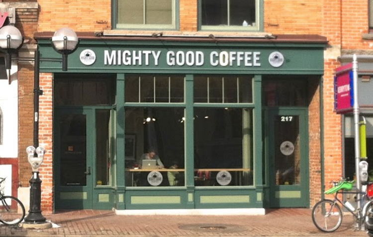
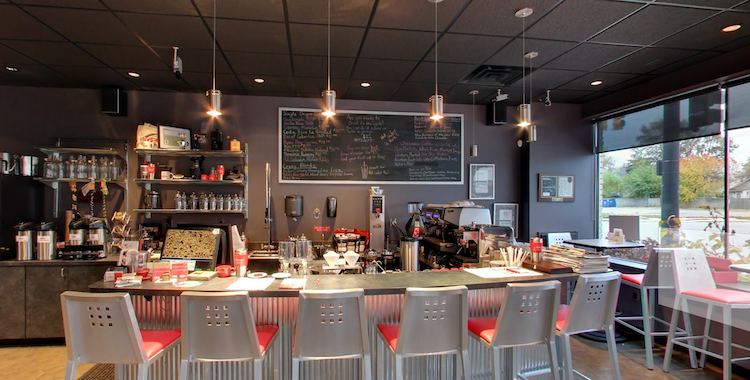
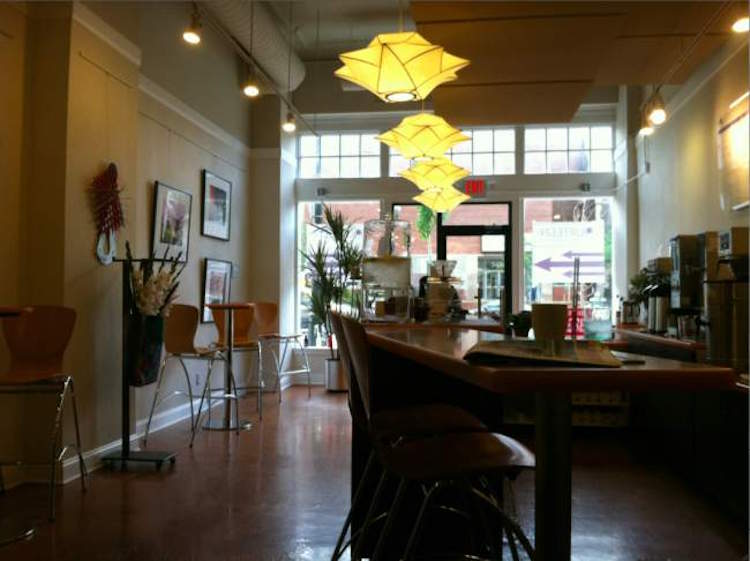
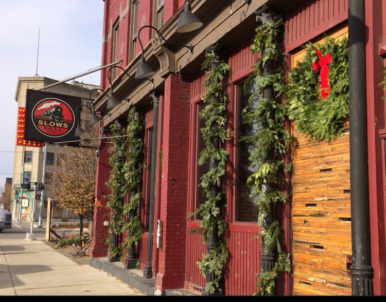
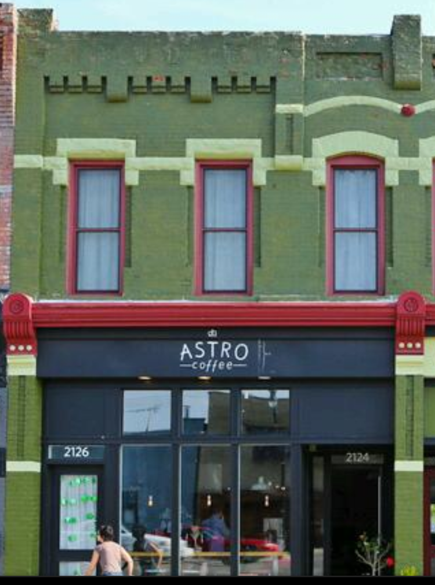

I'm staying in Detroit for the holidays and thought I'd do a working tour of area coffee shops.

**First stop - [Mighty Good](https://www.google.com/maps/place/Mighty+Good+Coffee/@42.2829829,-83.7484413,3a,75y,262.47h,90t/data=!3m6!1e1!3m4!1s4GEuOL0go2HJxqiwr8UI0w!2e0!7i13312!8i6656!4m2!3m1!1s0x0:0xfe1662cdc938a8aa!6m1!1e1) in Ann Arbor**

These guys were very friendly, almost too much so. Music moved through the day, starting with some soul in the
morning and evolving to alternative as the place filled up. The Latte was very good, the oatmeal was so so.

**Second Stop - [Chazzano Coffee Roasters](https://www.google.com/maps/place/Chazzano+Coffee/@42.4612477,-83.1137558,3a,75y,95.6h,90t/data=!3m4!1e1!3m2!1szpm2UuLBtIZ-VwDWth1Osg!2e0!4m2!3m1!1s0x0:0x9379ebafb7bea371?sa=X&ved=0ahUKEwiAsLvf9IHKAhVL2WMKHfD9BpgQoB8IiAEwEQ) in Ferndale**

This place was friendly. They knew when to be attentive and when to leave you alone, a skill in itself.
The music was very good. I heard a John Lennon album I don't think I've ever heard,
and looked up to see the barista jamming out to Hendrix. The Latte was excellent and I mean excellent.
You pick your coffee and milk. The selection of coffee's is impressive. They roast their own coffee.
I was sitting next to the grinder and under the speaker, so it was a tough spot for an introductory phone call.
I literally had do pause while they ran the grinder. I powered through it. (Apologies to Dan and Jason.)
A great place to hang out, or work in solitude.

**Third Stop - [Fourteen East](https://www.google.com/maps/place/Fourteen+East/@42.3601578,-83.0660267,3a,75y,329.58h,90t/data=!3m4!1e1!3m2!1szkB_EtH-mQNKjb02LzeGjA!2e0!4m2!3m1!1s0x0:0x575d589fc87add00?sa=X&ved=0ahUKEwj1-Yz09IHKAhVS7WMKHSoTBwMQpx8IgwEwCg) in Detroit**

This place was friendly. The music was classical, a very clean modern and warm look.
The Latte was good - they use Chazzano as their coffee supplier.
It was perfect working environment for the morning, more like an office than a place to hang out.
By afternoon, I need something with a little more energy.

**Bonus! - [Slows BarBq](https://www.google.com/maps/place/Slows+BarBq/@42.3316419,-83.0760543,3a,75y,151.26h,90t/data=!3m7!1e1!3m5!1s_Qo6gbh4-XGfuM7nXs1PTw!2e0!3e2!7i13312!8i6656!4m2!3m1!1s0x0:0xea0fb39d29292a38!6m1!1e1) in Detroit ([corktown](https://en.wikipedia.org/wiki/Corktown,_Detroit))**

I was on my way to my afternoon coffee shop (Astro) and to my delight it is right next to Slows.
I've heard about Slows for years but somehow I've never been.
Now that has been corrected! And yes it is worth the trip to Slows.

**Third Stop - Astro Coffee in Detroit ([corktown](https://en.wikipedia.org/wiki/Corktown,_Detroit))**

This place is so hip they don't even have wifi! And beards are standard, I felt a little left out.
With a personal hot-spot-tether to my phone I'm in business. (Good thing I've been on a data diet for the month of
December!) People are very 'cool' and 'cool friendly'. Makes me not
miss Brooklyn. (Not true, I miss Brooklyn.) The music was right up my alley -
like I could be listening to [KEXP](http://kexp.org/). The Latte was good.
(So far Chazzano had the best Latte by far.) The best part was snooping on the college students back for break,
catching up with friends, made me laugh quietly in the background.

