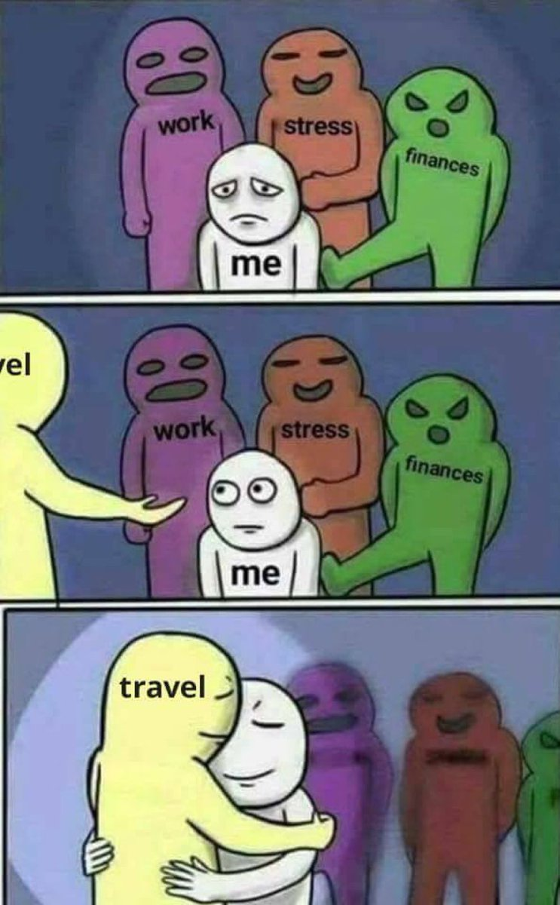
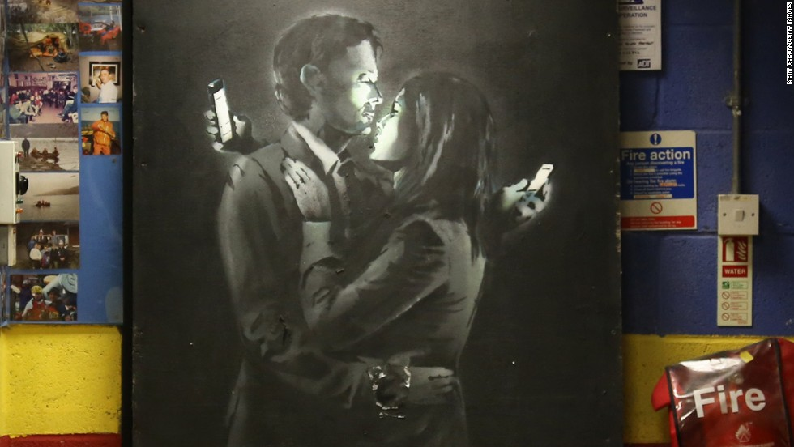

I know it sounds cliché, another software company trying to do something that ‘changes the world’. 
Sounds like a skit on Silicon Valley. (Wait, it is a skit on Silicon Valley.)

<iframe width="560" height="315" src="https://www.youtube-nocookie.com/embed/Rkj6PhhhzDk?rel=0&amp;start=20" frameborder="0" allow="autoplay; encrypted-media" allowfullscreen></iframe>

Touche, but stick with me here. 
As CTO of Geotix, I work with an amazing team building a world-class event ticketing system. 
And here’s a fact, and not a fake one: **One ticket can change the world**. 

## Say What?

Look, the human experience is tough. 
Life has a way of putting heavy rocks on our backs that we carry around and weigh us down.

Entertainment lifts those rocks from our backs. It relieves us from the heaviness of life. It makes life better and that makes us better. Better able to do great things.

A great live performance can change our perspective. It can lift our spirits and our eyes to what’s really important. It can make us laugh at what’s really scary and even scare us for laughing. It can start a conversation that we might never have. It connects us to what matters, to ourselves and to others. 

Look,  a play might not bring world peace, but if you took two world leaders of to see the magic of 
[A Midsummer Night's Dream](https://mynorthtickets.com/events/a-midsummer-night-s-dream-540108ec-b783-4d24-a650-e8288299da60), they’d be hard pressed not to agree on at least one thing. It’s a start. 

With everyone looking at their phone all the time.

Getting out with others, and actually interacting, face to face, can reconnect us to each other. 

Try it. What would happen if we all took this one step forward together? If each of us, got out and saw some local show, theater, or music, or festival, you never know what might change. Could be the world! Or just you. It just takes one ticket to one show...
